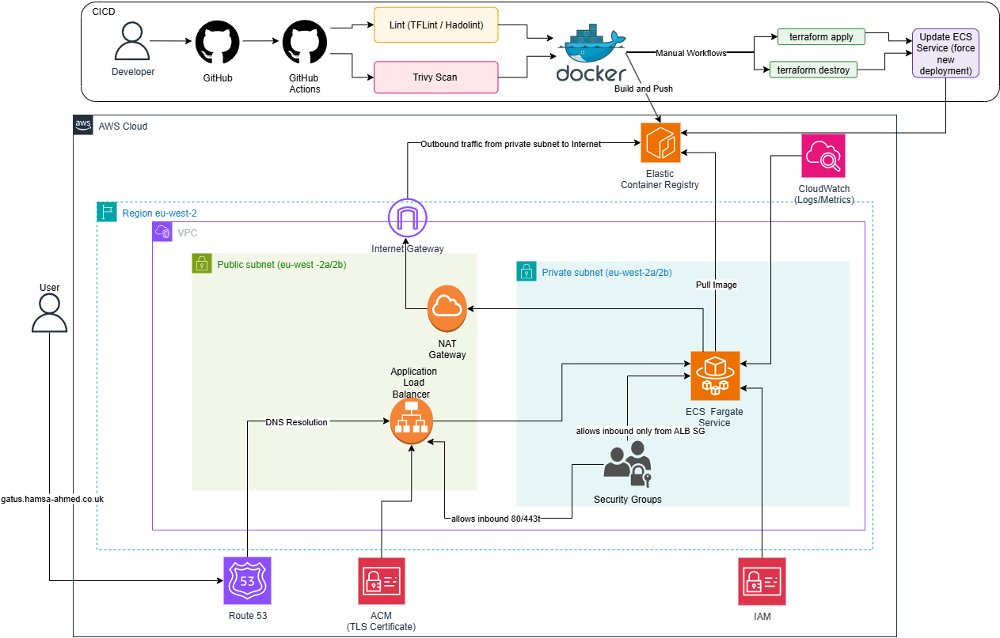

# Gatus ECS Project

A production deployment of Gatus (uptime monitoring tool) on AWS ECS Fargate with Terraform and GitHub Actions.

[](https://www.terraform.io/)
[](https://aws.amazon.com/)
[](https://www.docker.com/)

## What This Does

Deploys a containerized monitoring application on AWS with:
- ECS Fargate tasks running in private subnets
- Application Load Balancer handling HTTPS traffic
- Custom domain with auto-renewing SSL certificates
- High availability across multiple availability zones
- Automated deployments via GitHub Actions

## Architecture



**Traffic flow:** Route53 → ALB (public subnets) → ECS Tasks (private subnets)

---

## 📽 Live Demo

Watch the 1-minute demo of the Gatus ECS project in action:

https://github.com/user-attachments/assets/d1f58ef3-babf-4931-8671-de25c05f3932

---

## Quick Start
```bash
git clone https://github.com/HamsaHAhmed7/Gatus-ECS-Project.git
cd Gatus-ECS-Project/terraform

# Update terraform.tfvars with your domain and AWS details
terraform init
terraform apply
```

## Project Structure
```
.
├── Docker/              # Gatus container config
├── terraform/
│   ├── main.tf         # Root module
│   ├── variables.tf    # Variable definitions
│   ├── terraform.tfvars # Your configuration
│   ├── locals.tf       # Common tags
│   └── modules/        # Reusable infrastructure components
│       ├── vpc/
│       ├── alb/
│       ├── ecs-cluster/
│       ├── ecs-service/
│       ├── ecs-task/
│       ├── acm/
│       ├── route53/
│       ├── sg/
│       └── iam/
└── .github/workflows/  # CI/CD pipelines
```

## Infrastructure Components

**VPC Module**
- 2 public subnets (ALB)
- 2 private subnets (ECS tasks)
- 2 NAT gateways for high availability
- Internet gateway for public access

**ECS Setup**
- Fargate cluster with container insights
- Service with ALB health checks
- CloudWatch logging
- 256 CPU / 512 MB memory per task

**Networking**
- ALB with HTTPS listener (port 443)
- HTTP to HTTPS redirect
- Security groups: ALB accepts internet traffic, ECS only accepts from ALB

**DNS & SSL**
- Route53 A record pointing to ALB
- ACM certificate with automatic DNS validation

## Configuration

Edit `terraform/terraform.tfvars`:
```terraform
project_name = "gatus"
environment  = "production"
aws_region   = "eu-west-2"

domain_name    = "gatus.your-domain.com"
hosted_zone_id = "YOUR_HOSTED_ZONE_ID"

vpc_cidr = "10.0.0.0/16"

cluster_name = "gatus-cluster"
service_name = "gatus-service"
task_family  = "gatus-task"

image_url = "ACCOUNT_ID.dkr.ecr.REGION.amazonaws.com/gatus-project:latest"
```

## CI/CD Pipelines

### Build and Deploy
**Trigger:** Push to main branch

Builds Docker image, pushes to ECR, and deploys infrastructure with Terraform.

### Destroy
**Trigger:** Manual via GitHub Actions

Tears down all AWS infrastructure.

## Shift-Left Security

Pre-commit hooks run before every commit:
```bash
pre-commit install
```

Checks:
- Terraform formatting
- tfsec security scanning
- Trailing whitespace
- End-of-file fixes

## Local Development
```bash
# Run Gatus locally
cd Docker
docker build -t gatus-local .
docker run -p 8080:8080 gatus-local
```

## Screenshots

### Gatus Dashboard


### Terraform Deployment


### AWS ECS Cluster


### Terraform Destroy


## Requirements

- AWS account
- Domain with Route53 hosted zone
- Terraform >= 1.5
- Docker
- AWS CLI configured

## Cost Estimate

Approximate monthly cost (London region):
- ECS Fargate: ~£12
- NAT Gateways (2): ~£52
- ALB: ~£16
- Total: ~£80/month

## License

MIT
