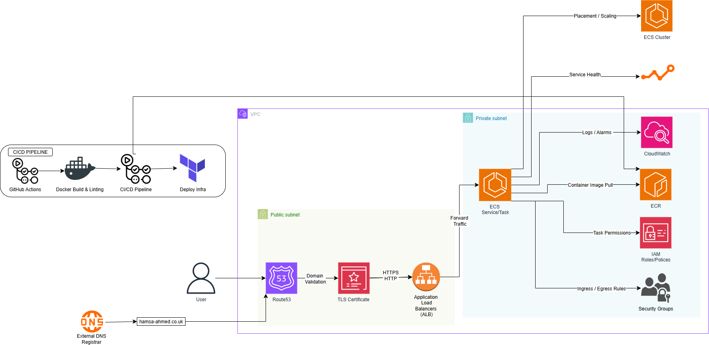
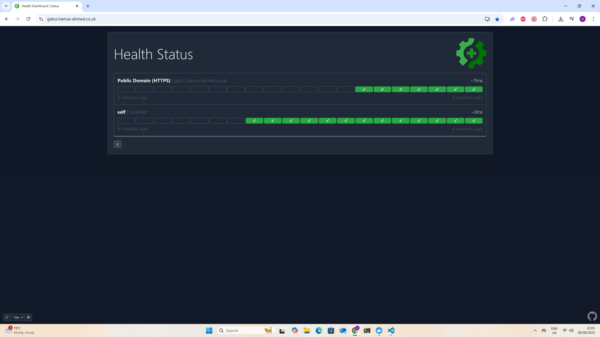
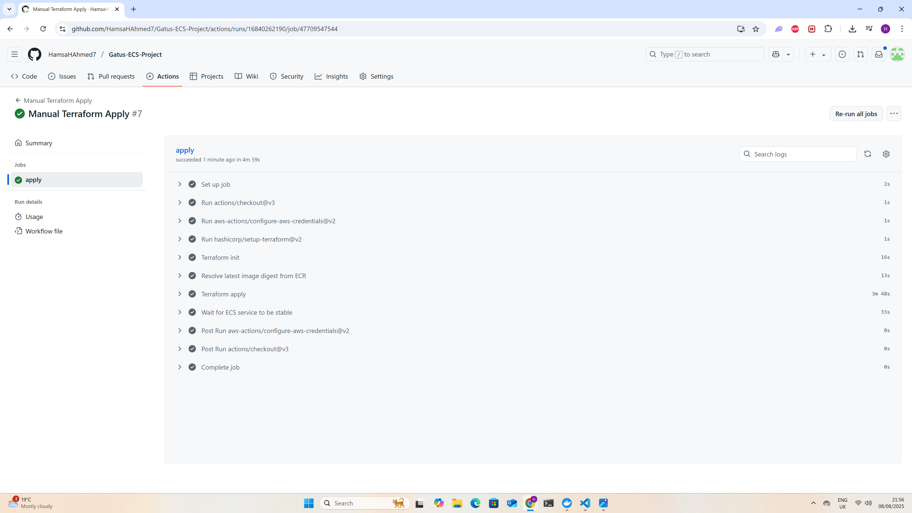
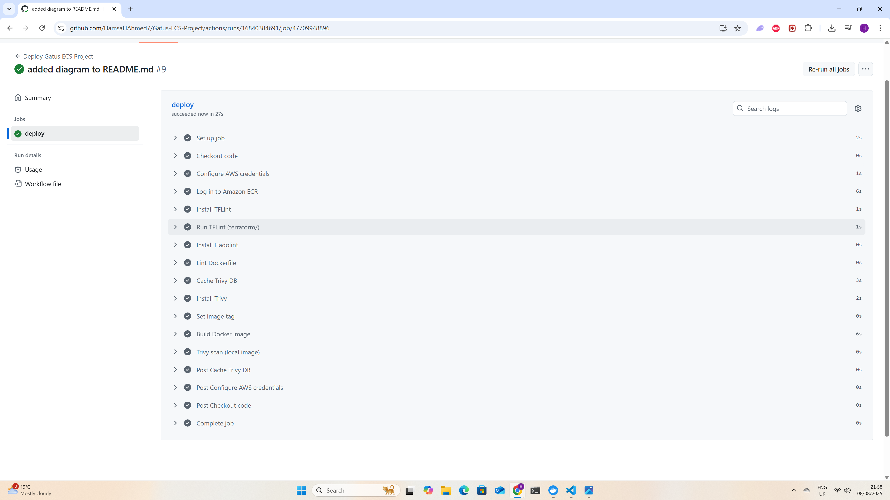
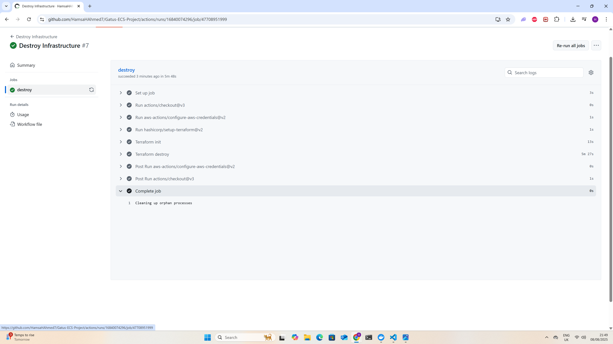
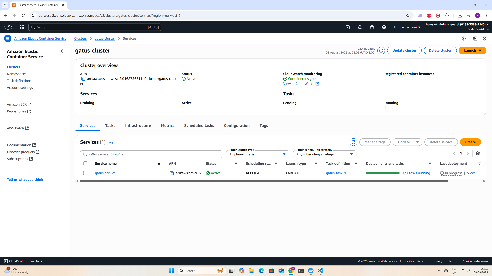

# Gatus ECS Project – End-to-End DevSecOps on AWS

[](https://www.terraform.io/)
[](https://github.com/features/actions)
[](https://www.docker.com/)
[](https://aws.amazon.com/)

## Overview

This project deploys **Gatus**, an open-source uptime monitoring tool, onto **AWS ECS Fargate** using a fully automated **CI/CD pipeline** and **Infrastructure as Code** (IaC) with Terraform.

The deployment is designed for **scalability, automation, and security**, using:
- **Private subnets** for ECS tasks (no direct internet access)
- An **Application Load Balancer (ALB)** for HTTPS routing
- **AWS Certificate Manager (ACM)** for TLS certificates
- **Route 53** for DNS management
- **Amazon ECR** for Docker image storage
- **GitHub Actions** for build, deploy, and destroy workflows

---
## Architecture Diagram



---

## Live Demo

https://gatus.hamsa-ahmed.co.uk/

---

## 📽 Live Demo Video

[Click here to watch the live demo](docs/gatus-live-demo.mp4)

---

## Key Highlights

- **Private Subnet Isolation** – ECS Fargate tasks run in private subnets to reduce the attack surface
- **Application Load Balancer (ALB)** – Handles HTTPS traffic and routes it to ECS tasks
- **TLS Encryption** – Enforced with ACM-issued certificates
- **Automated CI/CD** – Docker builds, pushes to ECR, and Terraform apply/destroy via GitHub Actions
- **Modular Terraform** – Reusable infrastructure modules for easy maintenance and scaling
- **Least-Privilege IAM** – Secure ECS execution roles and restricted policies

---

## Technologies Used

| Category       | Tools/Services                             |
|----------------|---------------------------------------------|
| **Cloud**      | AWS ECS (Fargate), ALB, ECR, ACM, VPC, Route 53 |
| **IaC**        | Terraform (modular)                         |
| **CI/CD**      | GitHub Actions                              |
| **Security**   | ACM TLS, IAM Roles, Security Groups         |
| **Container**  | Docker                                      |

---

## Architecture Overview

- **Public Subnet** – Hosts the ALB, which terminates HTTPS connections  
- **Private Subnet** – Runs ECS Fargate tasks for Gatus  
- **Route 53** – DNS resolution for the custom domain  
- **ECR** – Stores built Docker images pushed from GitHub Actions  
- **GitHub Actions** – Automates build, push, and deploy steps

### Traffic Flow:
1. Client request →  
2. Route 53 DNS record →  
3. ALB in public subnet →  
4. ECS Fargate task in private subnet →  
5. Gatus application container

---

## Directory Layout

```
Gatus-ECS-Project/
├── .github                        # GitHub Actions automation workflows
│   └── workflows
│       ├── apply.yml              # Manual Terraform apply workflow
│       ├── deploy.yml             # CI/CD pipeline for build & deploy
│       └── destroy.yml            # Manual Terraform destroy workflow
├── .gitignore                     # Git ignore rules for Terraform state, etc.
├── Docker                         # Docker build context for Gatus
│   ├── Dockerfile                 # Multi-stage Docker build for Gatus
│   ├── config.yaml                # Gatus monitoring configuration
│   └── docker-compose.yaml        # Local development/testing config
├── README.md                      # Project documentation
├── terraform                      # Infrastructure as Code root
│   ├── backend.tf                  # Remote backend configuration (S3/DynamoDB)
│   ├── main.tf                     # Main Terraform entrypoint
│   ├── outputs.tf                  # Outputs for infrastructure resources
│   ├── variables.tf                # Global variable definitions
│   └── modules                     # Modular Terraform components
│       ├── acm                     # ACM TLS certificate provisioning
│       │   ├── main.tf
│       │   ├── outputs.tf
│       │   └── variables.tf
│       ├── alb                     # Application Load Balancer setup
│       │   ├── main.tf
│       │   ├── outputs.tf
│       │   └── variables.tf
│       ├── ecs-cluster             # ECS cluster configuration
│       │   ├── main.tf
│       │   ├── outputs.tf
│       │   └── variable.tf
│       ├── ecs-service             # ECS Fargate service definition
│       │   ├── main.tf
│       │   ├── outputs.tf
│       │   └── variables.tf
│       ├── ecs-task                # ECS task definition & container settings
│       │   ├── main.tf
│       │   ├── outputs.tf
│       │   └── variables.tf
│       ├── iam                     # IAM roles & permissions for ECS
│       │   ├── main.tf
│       │   ├── outputs.tf
│       │   └── variables.tf
│       ├── route53                 # DNS records for domain pointing
│       │   ├── main.tf
│       │   ├── outputs.tf
│       │   └── variables.tf
│       └── sg                      # Security groups for ALB & ECS
│           ├── main.tf
│           ├── outputs.tf
│           └── variable.tf
```


## CI/CD Workflow

1. **Push to `main` branch**
   - Triggers GitHub Actions to:
     - Build Docker image from `Docker/Dockerfile`
     - Push image to ECR
     - Run Terraform to deploy infrastructure

2. **Manual Apply (`apply.yml`)**
   - Option to manually re-deploy the latest ECR image via Terraform

3. **Manual Destroy (`destroy.yml`)**
   - Tears down the ECS service, ALB, Route 53 records, and other resources

---

## Local Development Setup

### Prerequisites
- [Docker](https://www.docker.com/)
- [Terraform](https://www.terraform.io/)
- [AWS CLI](https://aws.amazon.com/cli/)
- AWS account with required permissions

### Steps

```bash
# 1. Clone repository
git clone https://github.com/HamsaHAhmed7/Gatus-ECS-Project.git
cd Gatus-ECS-Project

# 2. Build Docker image locally
docker build -t gatus-local -f Docker/Dockerfile Docker/

# 3. Run locally
docker run -p 8080:8080 gatus-local
```


## Why This Project?

This setup demonstrates real-world AWS DevOps deployment practices:

- **Secure networking** with private subnets
- **Automated builds** and deployments
- **Modular IaC** with Terraform
- **TLS encryption** for all traffic
- **Fully reproducible infrastructure**

---

## 📸 Screenshots

### 1. Gatus Live App
Custom domain with HTTPS and active uptime monitoring checks.  


---

### 2. Terraform Apply
Automated infrastructure creation via GitHub Actions workflow.  


---

### 3. Terraform Deploy
Deployment pipeline pushing Docker image to ECR and updating ECS service.  


---

### 4. Terraform Destroy
Automated teardown of AWS infrastructure using GitHub Actions.  


---

### 5. AWS ECS Cluster
ECS Cluster running Gatus tasks in private subnets, behind an ALB.  


---