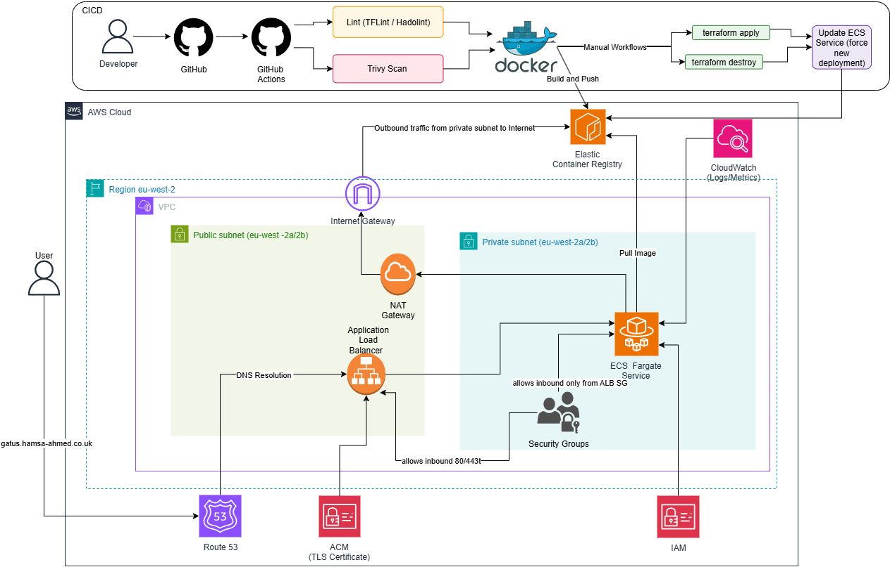
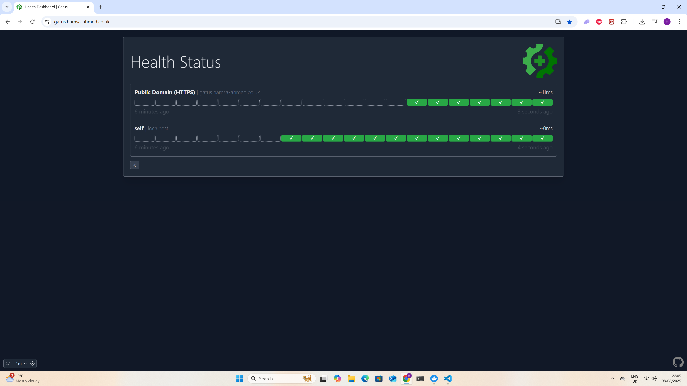
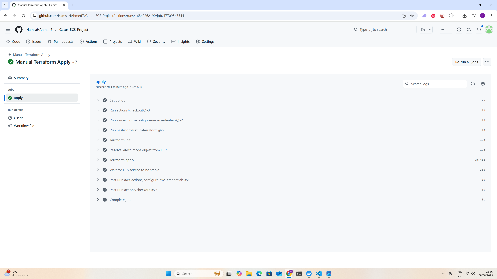
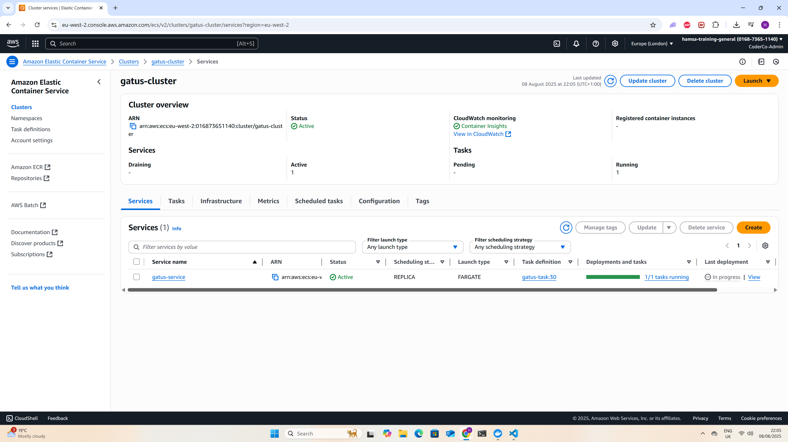
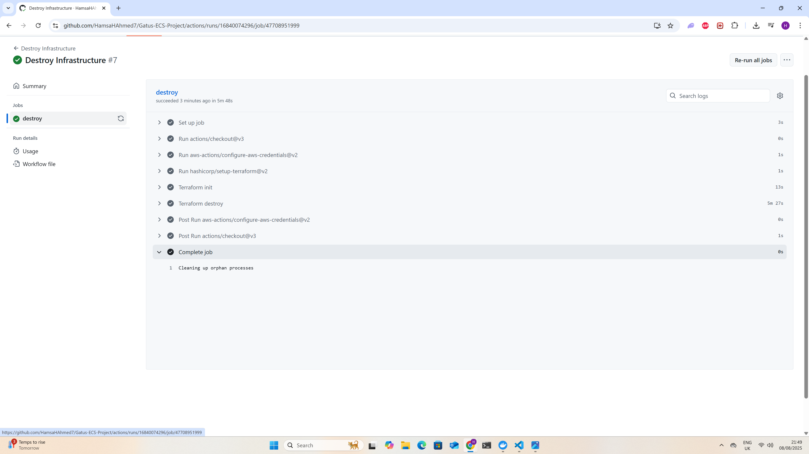

# Gatus Monitoring Platform on AWS ECS

Production deployment of Gatus health monitoring on AWS ECS Fargate. This project demonstrates building cloud infrastructure from scratch with proper networking, security, and automation.

[](https://www.terraform.io/)
[](https://aws.amazon.com/)
[](https://www.docker.com/)

---

## Demo

https://github.com/user-attachments/assets/d1f58ef3-babf-4931-8671-de25c05f3932

---

## What This Project Does

Gatus is a health monitoring tool that checks if your services are up. I deployed it on AWS ECS Fargate with a proper production setup: private subnets, load balancing, HTTPS, and a custom domain. The infrastructure is fully automated with Terraform.



**How it works:** Traffic hits the load balancer in public subnets, gets routed to containers running in private subnets, and those containers reach the internet through NAT gateways for monitoring external endpoints.

---

## Key Technical Decisions

**Multi-AZ Setup**
I deployed across two availability zones with separate NAT gateways. If one zone fails, the other keeps running. Most tutorials skip this but it's essential for production.

**Private Subnets for Containers**
The ECS tasks run in private subnets with no public IPs. Only the load balancer is internet-facing. This limits the attack surface significantly.

**Built from Source**
Instead of using the pre-built Gatus image, I cloned the repo and built it myself using multi-stage Docker builds. Final image is around 45MB vs 150MB for the official one.

**Security Groups with Least Privilege**
The ECS security group only allows traffic from the ALB security group on port 8080. For egress, I restricted it to ports 80, 443, and 53 instead of allowing everything.

**TLS 1.3 Only**
The load balancer enforces TLS 1.3 and automatically redirects HTTP to HTTPS. Certificates are managed by AWS Certificate Manager with DNS validation.

---

## Infrastructure Highlights

**Network Architecture:**
- VPC with 10.0.0.0/16 CIDR
- 2 public subnets (10.0.1.0/24, 10.0.2.0/24) for ALB and NAT gateways
- 2 private subnets (10.0.11.0/24, 10.0.12.0/24) for ECS tasks
- Dual NAT gateways for high availability egress
- Internet gateway for inbound traffic to ALB

**Compute:**
- ECS Fargate (0.25 vCPU, 512MB memory)
- awsvpc network mode
- CloudWatch logs with 7-day retention
- Health checks every 30 seconds

**Load Balancing:**
- Application Load Balancer in public subnets
- HTTPS listener with ACM certificate
- HTTP listener that redirects to HTTPS
- Health checks with 3/3 threshold

**DNS & SSL:**
- Route53 alias record pointing to ALB
- ACM certificate with automatic DNS validation
- Let's Encrypt-style automation but through AWS

---

## Project Structure
```
.
├── gatus-app/              # Gatus source code
│   ├── Dockerfile          # Multi-stage build
│   └── config.yaml         # Monitoring config
├── terraform/
│   ├── modules/
│   │   ├── vpc/           # Networking (VPC, subnets, NAT, IGW)
│   │   ├── alb/           # Load balancer and listeners
│   │   ├── ecs-cluster/   # ECS cluster
│   │   ├── ecs-service/   # Fargate service definition
│   │   ├── ecs-task/      # Task definition and logging
│   │   ├── acm/           # SSL certificate
│   │   ├── route53/       # DNS records
│   │   ├── iam/           # IAM roles for ECS
│   │   └── sg/            # Security groups
│   ├── backend.tf         # S3 state storage
│   ├── main.tf            # Module orchestration
│   ├── terraform.tfvars   # Configuration values
│   └── variables.tf       # Variable definitions
└── docs/                   # Screenshots and diagrams
```

---

## Getting Started

You'll need AWS CLI configured, Terraform installed, and a Route53 hosted zone for your domain.

**Step 1: Clone the repo**
```bash
git clone https://github.com/HamsaHAhmed7/Gatus-ECS-Project.git
cd Gatus-ECS-Project
```

**Step 2: Edit terraform.tfvars**
```hcl
domain_name    = "gatus.your-domain.com"
hosted_zone_id = "Z1234567890ABC"  # Your Route53 zone ID
image_url      = "123456789.dkr.ecr.eu-west-2.amazonaws.com/gatus-project:latest"
vpc_cidr       = "10.0.0.0/16"
```

**Step 3: Deploy**
```bash
cd terraform
terraform init
terraform plan
terraform apply
```

Wait about 5 minutes for everything to spin up. The ACM certificate validation takes the longest.

**Step 4: Access your instance**
```
https://gatus.your-domain.com
```

---

## Security Implementation

**Network Isolation:**
```
Internet
  ↓
ALB Security Group (ports 80, 443 from anywhere)
  ↓
ECS Security Group (port 8080 from ALB only)
  ↓
ECS Tasks in Private Subnets
  ↓
NAT Gateway (egress on 80, 443, 53 only)
  ↓
Internet
```

**IAM Roles:**
- Task Execution Role: Pulls images from ECR, writes logs to CloudWatch
- Task Role: Currently empty (Gatus doesn't need AWS API access)

Both follow least privilege - only the permissions absolutely required.

---

## Why I Made These Choices

**Why private subnets?**
I wanted to understand how production apps are deployed. Putting containers in public subnets is easier but it means they're directly accessible from the internet if something goes wrong with security groups.

**Why two NAT gateways?**
One NAT per AZ is the AWS recommended pattern. If I only had one and that AZ failed, containers in the other AZ couldn't reach the internet. Costs more but that's the trade-off for HA.

**Why Fargate instead of EC2?**
I didn't want to manage instances. Fargate handles patching, scaling, and host management. For a single container app like this, EC2 is overkill.

**Why build from source?**
I wanted to show I can read Go code, understand multi-stage builds, and optimize container images. Also gives me full control over what's in the image.

---

## Screenshots

**Gatus Dashboard**


**Terraform Apply**


**ECS Console**


**Infrastructure Teardown**


---

## Monthly Cost Breakdown

Running in London (eu-west-2):

| Component | Cost |
|-----------|------|
| Fargate (0.25 vCPU, 512MB) | £12 |
| NAT Gateways (2x) | £52 |
| Application Load Balancer | £16 |
| Route53 | £0.40 |
| CloudWatch Logs | £2 |
| **Total** | **£82/month** |

The NAT gateways are expensive. You could use one instead of two and save £26/month, but you lose the high availability guarantee.

---

## What I Learned

**Terraform modules are worth it**
Initially I had everything in one file. Breaking it into modules made it way easier to understand and reuse. The VPC module alone is 200+ lines.

**Security groups are more powerful than I thought**
You can reference other security groups instead of CIDR blocks. This means "allow traffic from the ALB" instead of "allow traffic from these specific IPs."

**NAT gateways vs NAT instances**
NAT gateways are managed by AWS but cost more. NAT instances are cheaper but you manage them. For production, managed services win.

**DNS validation is better than email validation**
ACM can validate your domain ownership through DNS records. Way faster than waiting for emails and you can automate it in Terraform.

**awsvpc mode is the only real option for Fargate**
Each task gets its own ENI with a private IP from your subnet. This is different from bridge mode on EC2 where containers share the host network.

---

## What I'd Add Next

- Auto-scaling policies based on CPU/memory
- CloudWatch alarms that actually notify me when things break
- Blue/green deployments with CodeDeploy
- ALB access logs to S3 for debugging
- VPC Flow Logs for network troubleshooting
- Separate dev/staging/prod environments
- GitHub Actions for CI/CD
- Container Insights for better metrics

---

## Local Development

Build and run locally:
```bash
cd gatus-app
docker build -t gatus-local .
docker run -p 8080:8080 gatus-local
```

Test Terraform changes:
```bash
cd terraform
terraform validate
terraform plan
```

---

## Teardown
```bash
cd terraform
terraform destroy
```

This removes everything: ECS cluster, load balancer, NAT gateways, VPC, Route53 records, CloudWatch logs. The hosted zone stays (Terraform doesn't manage it).

---

## Tech Stack

**AWS Services:** ECS Fargate, VPC, ALB, NAT Gateway, Route53, ACM, ECR, CloudWatch
**Infrastructure:** Terraform with modular architecture and S3 remote state
**Container:** Docker with multi-stage builds
**Application:** Gatus (health monitoring)

---

## Requirements

- AWS account
- Route53 hosted zone for your domain
- Terraform 1.0 or newer
- AWS CLI configured locally
- Docker for building images

---

## Author

Hamsa Ahmed
DevOps Engineer based in London

---

## License

MIT

---

## Related Work

I also built a [Kubernetes deployment on EKS](https://github.com/HamsaHAhmed7/EKS-Game-Project) with ArgoCD, Prometheus, and Grafana if you want to see more infrastructure projects.
