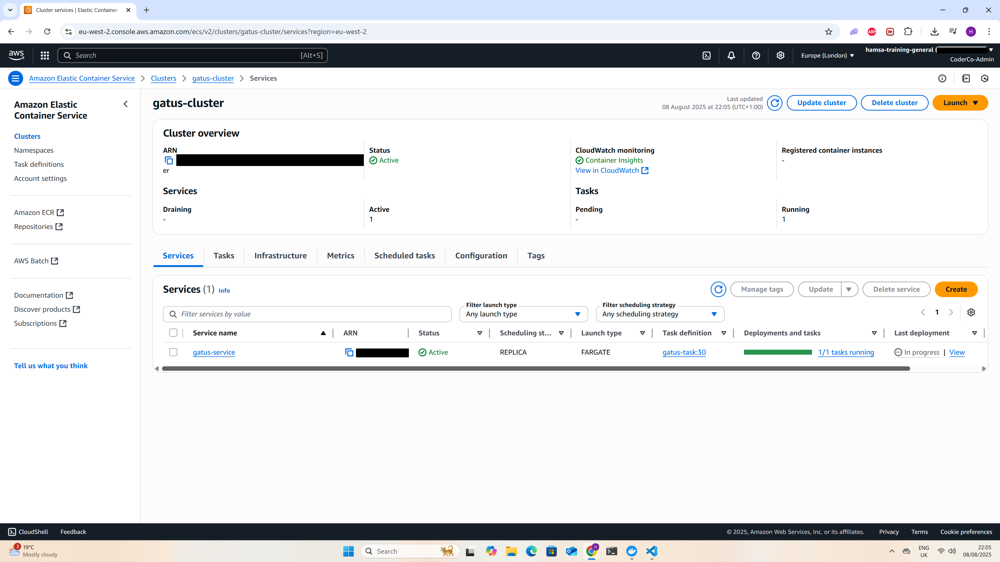

# Gatus ECS Project – End-to-End DevSecOps on AWS

[](https://www.terraform.io/)
[](https://github.com/features/actions)
[](https://www.docker.com/)
[](https://aws.amazon.com/)
[](https://aquasecurity.github.io/trivy/)
[](https://github.com/hadolint/hadolint)
[](https://github.com/terraform-linters/tflint)

## Overview

This project deploys **Gatus**, an open-source uptime monitoring tool, onto **AWS ECS Fargate** using a **secure, automated, and fully reproducible DevSecOps pipeline**.

It incorporates:
- **Private subnets** for ECS tasks (no public IP exposure)
- **Application Load Balancer (ALB)** for HTTPS traffic
- **AWS Certificate Manager (ACM)** for TLS
- **Route 53** for DNS
- **Amazon ECR** for storing scanned Docker images
- **Terraform IaC** for infrastructure
- **Linting** for both Terraform and Dockerfiles
- **Trivy security scans** for container vulnerabilities
- **Immutable image digests** for deployments
- **GitHub Actions** for CI/CD automation
---
## Architecture Diagram


---

## 📽 Live Demo

Watch the 1-minute demo of the Gatus ECS project in action:

https://github.com/user-attachments/assets/d1f58ef3-babf-4931-8671-de25c05f3932


---
## Local Development Setup

### Prerequisites
- [Docker](https://www.docker.com/)
- [Terraform](https://www.terraform.io/)
- [AWS CLI](https://aws.amazon.com/cli/)
- AWS account with required permissions

### Steps

```bash
# 1. Clone repository
git clone https://github.com/HamsaHAhmed7/Gatus-ECS-Project.git
cd Gatus-ECS-Project

# 2. Build Docker image locally
docker build -t gatus-local -f Docker/Dockerfile Docker/

# 3. Run locally
docker run -p 8080:8080 gatus-local
```

---


## Technologies Used

| Category       | Tools/Services                             |
|----------------|---------------------------------------------|
| **Cloud**      | AWS ECS (Fargate), ALB, ECR, ACM, VPC, Route 53 |
| **IaC**        | Terraform (modular)                         |
| **CI/CD**      | GitHub Actions                              |
| **Security**   | ACM TLS, IAM Roles, Security Groups, Trivy   |
| **Linting**    | TFLint, Hadolint                             |
| **Container**  | Docker                                      |

---

### Traffic Flow:
1. Client request →  
2. Route 53 DNS record →  
3. ALB in public subnet →  
4. ECS Fargate task in private subnet →  
5. Gatus application container

---

## Directory Layout

.
├── Docker
│   ├── Dockerfile
│   ├── config.yaml
│   └── docker-compose.yaml
├── README.md
├── docs
├── terraform
│   ├── backend.tf
│   ├── main.tf
│   ├── modules
│   │   ├── acm
│   │   │   ├── main.tf
│   │   │   ├── outputs.tf
│   │   │   └── variables.tf
│   │   ├── alb
│   │   │   ├── main.tf
│   │   │   ├── outputs.tf
│   │   │   └── variables.tf
│   │   ├── ecs-cluster
│   │   │   ├── main.tf
│   │   │   ├── outputs.tf
│   │   │   └── variable.tf
│   │   ├── ecs-service
│   │   │   ├── main.tf
│   │   │   ├── outputs.tf
│   │   │   └── variables.tf
│   │   ├── ecs-task
│   │   │   ├── main.tf
│   │   │   ├── outputs.tf
│   │   │   └── variables.tf
│   │   ├── iam
│   │   │   ├── main.tf
│   │   │   ├── outputs.tf
│   │   │   └── variables.tf
│   │   ├── route53
│   │   │   ├── main.tf
│   │   │   ├── outputs.tf
│   │   │   └── variables.tf
│   │   └── sg
│   │       ├── main.tf
│   │       ├── outputs.tf
│   │       └── variable.tf
│   ├── outputs.tf
│   ├── terraform.tfstate
│   ├── terraform.tfstate.backup
│   ├── terraform.tfvars
│   └── variables.tf
└── terraform.tfstate

---

## CI/CD Workflow – Secure Deployment Pipeline

### **1. Deploy Workflow (`deploy.yml`)**
Triggered on push to `main`:
1. **Checkout Code** – Pull latest repository state
2. **Configure AWS Credentials** – From GitHub Secrets
3. **Login to Amazon ECR** – Secure authentication
4. **Terraform Linting (TFLint)** – Scans IaC for best practices & errors
5. **Dockerfile Linting (Hadolint)** – Enforces container build best practices
6. **Cache Trivy DB** – Speeds up vulnerability scans
7. **Install & Run Trivy** – Scans Docker image for HIGH/CRITICAL CVEs
8. **Build Docker Image** – From `Docker/Dockerfile`
9. **Push to ECR** – Only if linting & scanning pass
10. **Terraform Apply** – Deploys ECS service with latest immutable image digest
11. **Wait for ECS Stability** – Ensures service is healthy

### **2. Manual Apply Workflow (`apply.yml`)**
- Fetches latest **immutable image digest** from ECR
- Passes digest to Terraform (`TF_VAR_image_url`)
- Deploys ECS service
- Waits until ECS service is healthy before completion

### **3. Manual Destroy Workflow (`destroy.yml`)**
- Removes ECS service, ALB, Route 53 records, and networking resources


---

## 📸 Screenshots

### 1. Gatus Live App
Custom domain with HTTPS and active uptime monitoring checks.  


---

### 2. Terraform Apply
Automated infrastructure creation via GitHub Actions workflow.  


---

### 3. Terraform Deploy
Deployment pipeline pushing Docker image to ECR and updating ECS service.  


---

### 4. Terraform Destroy
Automated teardown of AWS infrastructure using GitHub Actions.  


---

### 5. AWS ECS Cluster
ECS Cluster running Gatus tasks in private subnets, behind an ALB.  


---